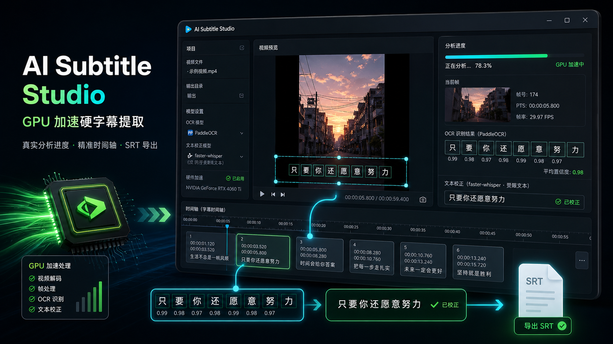

# AI Subtitle Studio


AI Subtitle Studio 是一个完整可运行的 AI 视频字幕辅助制作平台。它以 PaddleOCR
检测画面硬字幕，用 faster-whisper 在视觉事件内受限校字，通过网页完成 ROI 框选、
任务恢复、校对、逐帧时间轴检查、自动保存与 SRT 导出；同时以独立 WhisperX job
生成句级音频字幕和词级时间戳，由用户选择视觉轨或音频轨进入最终字幕。

本项目是从旧 Tkinter 原型重新设计的新工程；旧目录 `D:\new project` 未被修改。
详细审查见 [旧项目代码审查报告](docs/OLD_PROJECT_REVIEW.md)。

## 已实现的产品闭环

1. React 页面拖放或选择 MP4；上传后任务停在 `awaiting_roi`。
2. 用户在真实视频内容上拖拽、移动或缩放字幕框，确认后才启动识别。
3. Express 校验并持久化归一化 ROI，原子地将任务入队并提交 AI 服务。
4. FastAPI 只裁剪用户框选区域，粗抽帧发现视觉字幕并保留全部 OCR 候选。
5. 视觉变化扫描定位边界，再以固定 OCR 预算精修到接近源视频单帧。
6. OCR 决定视觉轨条数和时间轴；faster-whisper 只能在当前视觉事件内受限校字。
7. WhisperX 音频任务与视觉任务并行运行，保留句级字幕和 `words[]` 词级时间戳；两轨
   不自动融合、不强制对齐。
8. 处理中页面通过 SSE 展示真实分析帧、ROI、PaddleOCR 候选、容器 PTS、阶段和字幕计数；
   刷新或断线后按 `run_id + seq` 恢复。
9. 工作台以双栏只读展示视觉/音频来源；Use Visual / Use Audio 只复制所选轨到独立 Final。
10. `/tasks` 任务中心可恢复全部状态；播放器与最终时间轴支持逐帧检查。
11. 最终字幕修改 750ms 防抖自动保存；失败时按 taskId 写 IndexedDB，revision 冲突返回 409。

## 架构

```text
React + Vite :5173
        │ REST / Range / SSE / JPEG
Express :3001 ───── MongoDB（推荐）/ JSON 文件降级
        │ visual + audio 独立 job / polling / progress replay
FastAPI :8000
        ├── PyAV PTS 视频读取与抽帧
        ├── PaddleOCR 硬字幕检测
        ├── faster-whisper 文本校验与断句
        ├── WhisperX 独立音频轨与词级对齐
        └── JSONL 事件 + 限频 JPEG 预览
```

更完整的状态流、数据模型和设计取舍见 [架构说明](docs/ARCHITECTURE.md)。

### P1-A 可视化分析进度

- FastAPI 为每次运行生成 32 位 `run_id`；每个事件带严格递增的 `seq`，类型包括
  `stage.progress`、`frame.analyzed`、`cue.upserted`、`job.completed` 和 `job.failed`。
- Express 将短轮询汇聚为共享 SSE；浏览器用 `Last-Event-ID: run_id:seq` 补发、去重，
  上游故障或慢消费者会主动断流，由有限退避重连继续恢复，不会取消后台任务。
- 原帧/ROI 使用随机不可猜测 ID 的 JPEG 代理。普通预览按时间限频并最多保留 8 组；
  终态删除普通预览，边界 OCR evidence 单独保留。任务 JSON 只保存最新事件、最新帧和
  最新有图帧，不嵌入完整历史。
- AI 重启恢复在服务启动阶段幂等执行：普通中断收敛为 failed，已经写完结果的提交窗口
  收敛为 completed；先检查 JSONL 尾部避免重复终态，并清扫终态遗留的普通预览。
- 事件历史位于 `data/progress/<task_id>/<run_id>/events.jsonl`。当前保留它用于重启与
  短期断线恢复；尚未实现生产环境的 TTL/压缩归档策略。

## 目录

```text
AI-Subtitle-Studio/
├── frontend/                   React + Vite Web 字幕编辑器
│   └── src/
│       ├── api/                后端 API 封装
│       ├── components/         上传、播放器、字幕表、时间轴
│       ├── hooks/              任务轮询
│       ├── pages/              任务中心、上传与任务工作区
│       └── utils/              时间、字幕校验与 IndexedDB 草稿
├── backend/                    Express 编排服务
│   ├── routes/                 任务、字幕、视频和导出 API
│   ├── models/                 Mongoose VideoTask
│   ├── services/               AI 客户端、任务仓库、SRT 服务
│   ├── middleware/             统一错误处理
│   └── test/                   Node 原生测试
├── ai_service/                 FastAPI AI 服务
│   ├── video/                  PyAV PTS 读取、抽帧和边界映射
│   ├── ocr/                    PaddleOCR 2.x/3.x 适配器
│   ├── whisper/                faster-whisper 适配器
│   ├── whisperx/               WhisperX 独立音频轨适配器
│   ├── alignment/              OCR 时序聚合与 OCR/ASR 融合
│   ├── subtitle/               JSON、SRT 与字幕指标
│   ├── evaluation/             视觉时间轴真值评估器
│   └── tests/                  Pytest 测试
├── data/
│   ├── videos/                 AI 服务运行时视频
│   ├── subtitles/              OCR、JSON 与 SRT 产物
│   ├── ground_truth/            人工逐帧视觉字幕真值
│   ├── jobs/                   AI job 快照
│   ├── audio_jobs/             WhisperX job 快照
│   └── progress/               运行事件、临时预览与边界 evidence
├── docs/                       审查、架构、测试与实施记录
├── scripts/                    安装与样例评测脚本
└── docker-compose.yml          可选 MongoDB
```

## 环境要求

- Windows 10/11（当前实测环境）；Linux/macOS 也可运行
- Python 3.12
- Node.js 20+
- MongoDB 6+（推荐但非启动必需）
- 首次 PaddleOCR / Whisper 运行需下载模型；之后可离线推理

当前 Windows 上 PaddlePaddle 3.x 的 oneDNN/PIR 兼容开关已在代码中处理。

## 一次性安装

可在项目根目录执行：

```powershell
.\scripts\setup.ps1
```

安装脚本默认安装可独立工作的 OCR 基础环境。启用 WhisperX 词级时间戳还需安装与本机
Torch/CUDA 组合匹配的可选依赖：

```powershell
cd D:\AI-Subtitle-Studio\ai_service
python -m pip install -r requirements-whisperx.txt
```

也可以分别安装：

```powershell
cd D:\AI-Subtitle-Studio\ai_service
python -m pip install -r requirements-whisperx.txt

cd D:\AI-Subtitle-Studio\backend
npm install

cd D:\AI-Subtitle-Studio\frontend
npm install
```

建议为 Python 创建虚拟环境后再安装依赖。

## 启动

打开三个 PowerShell 终端。

AI Service：

```powershell
cd D:\AI-Subtitle-Studio\ai_service
python main.py
```

Backend：

```powershell
cd D:\AI-Subtitle-Studio\backend
copy .env.example .env
npm run dev
```

Frontend：

```powershell
cd D:\AI-Subtitle-Studio\frontend
copy .env.example .env.local
npm run dev
```

打开 `http://localhost:5173`，根路径会进入 `/tasks` 任务中心。服务健康检查分别为：

- `http://localhost:8000/health`
- `http://localhost:3001/api/health`

### 使用 MongoDB

```powershell
cd D:\AI-Subtitle-Studio
docker compose up -d mongo
```

在 `backend/.env` 中设置：

```env
MONGODB_URI=mongodb://127.0.0.1:27017/ai_subtitle_studio
```

未配置 MongoDB 或连接失败时，后端会明确提示并降级到
`data/tasks.json`；这让本地 MVP 仍可完整运行。多实例或生产部署必须使用
MongoDB 与共享对象存储。

## 使用真实样例评测

默认脚本使用用户提供的旧项目测试素材，并采用前端为该素材预置的手动 ROI
`{x:0.08,y:0.52,width:0.84,height:0.24}`：

```powershell
.\scripts\evaluate-test-video.ps1
```

等价命令：

```powershell
python ai_service\cli.py `
  "D:\new project\test\testVideo.mp4" `
  --roi 0.08 0.52 0.84 0.24 `
  --ground-truth "D:\new project\test\testVideo.txt" `
  --output "D:\AI-Subtitle-Studio\data\subtitles\test-video"
```

产物：

- `data/subtitles/test-video/ocr_events.json`
- `data/subtitles/test-video/subtitle.json`
- `data/subtitles/test-video/output.srt`
- `data/subtitles/test-video/diagnostics.json`

用整片 58 状态人工视觉真值评测最终时间轴：

```powershell
python scripts\evaluate-visual-timeline.py `
  data\ground_truth\test-video.visual.json `
  data\subtitles\test-video\subtitle.json `
  --output data\subtitles\test-video\visual-evaluation.json
```

## 当前实测结果

在 1080×1920、2,380 帧、39.7063 秒的真实 `testVideo.mp4` 整片上：

- 上传后保持 `awaiting_roi`；用户确认前不会创建 FastAPI job，确认后才进入 `queued`
- ROI 从 React → Express → FastAPI 原样持久化为
  `{x:0.08,y:0.52,width:0.84,height:0.24}`
- 58 条人工视觉状态中检出 57 条：Precision 1.0000、Recall 0.9828、F1 0.9913
- 57/57 个匹配事件的归一化文本完全一致；无误报、无最终字幕时间重叠
- 开始边界 MAE 1.053 帧，最终结束边界 MAE 0.351 帧
- Tier A 的五个相邻帧复核事件 5/5 起止边界完全一致
- `WATCH OUT` 为 `21.104–21.438s`；`PROTECT YOURSELF` 为
  `29.546–30.330s`，没有附加后续语音句子
- 唯一漏检是第 13–21 帧、约 0.15 秒的开场文字入场动画；这些帧中的 OCR 文字尚未
  完整可读，系统选择不凭空补字
- 完整 CPU 回归使用 80 次粗采样 OCR、20 次短事件发现 OCR、137 次边界 OCR 和
  14 个 Whisper 校字窗口，无警告，耗时约 534 秒
- P0 时间校准使用 PyAV 原始 PTS；目标 Byron 视频实测为 29.97 FPS、`time_base=1/11988`、
  `start_pts=400`。相邻源帧 762/763 正好从 `AND HEAL THEM` 切到 `WHEN YOU CAN`；映射
  边界为 25.458792 秒，相对旧 25.460 秒误差 1.208ms，小于一个 33.367ms 呈现帧
- AI / Backend / Frontend 自动化测试分别为 80 / 27 / 62 项；compile、lint 与生产构建通过
- P1-A 最终真实 Web 验收使用现有 1080×1920、252 帧样片：主动在 seq 4 断开后，经
  3 个 SSE 补发分段连续恢复到 seq 54，无重复或倒退，收到 5 条字幕的终态；新开的
  Edge 页面恢复到 boundary refinement，并展示真实帧、ROI、OCR、PTS 与 5 条事件计数
- 该快速验收配置为 1 FPS、关闭短事件发现，仅验证进度协议与 UI，不替代上面的 2 FPS
  完整视觉准确率回归
- 隔离任务库的真实 HTTP 验收恢复了目标历史任务的 88 条字幕；分页轻量摘要、刷新路由、
  revision 0→1、第二标签式旧版本 409、后端重启后 revision/字幕恢复均通过

这里的检出率来自 `data/ground_truth/test-video.visual.json` 的逐事件视觉真值；
`testVideo.txt` 仍只是语音粗转写，不能代替硬字幕真值。Tier A 是逐相邻帧精确复核，
其余 Tier B 边界带有 ±18 帧标注不确定度，因此不能把整片结果描述成“100% 单帧精确”。
完整证据和限制见 [测试报告](docs/TEST_REPORT.md)。

## 测试命令

```powershell
cd D:\AI-Subtitle-Studio\ai_service
python -m pytest tests -q

cd D:\AI-Subtitle-Studio\backend
npm test

cd D:\AI-Subtitle-Studio\frontend
npm run lint
npm run test
npm run build
```

## 配置

- AI：`ai_service/.env.example`
- Backend：`backend/.env.example`
- Frontend：`frontend/.env.example`

AI 服务默认 2 FPS 粗采样、每个起止边界最多新增 2 次 OCR、Whisper 模型为 `small`
CPU/int8。Web 工作流使用手动框选 ROI；当前测试素材的推荐初始框为
`0.08 0.52 0.84 0.24`。CLI 未传 `--roi` 时才使用
`OCR_ROI_TOP`/`OCR_ROI_BOTTOM` 的兼容默认区域。可用 `SAMPLE_FPS` 和
`BOUNDARY_OCR_BUDGET` 调整速度/边界确认预算。
`PREVIEW_INTERVAL_SECONDS`、`PREVIEW_RING_SIZE`、`PREVIEW_MAX_LONG_EDGE` 和
`PREVIEW_JPEG_QUALITY` 控制 P1-A 预览的频率、环形上限、尺寸和质量。

### GPU 模式怎么开启

当前代码已经完成设备参数传递：`ai_service/config.py` 读取 `OCR_DEVICE`，
`ai_service/pipeline.py` 将设备传给 `PaddleOCREngine`，PaddleOCR 3.x 使用
`device="gpu:0"`，旧兼容分支使用 `use_gpu=True`；faster-whisper 则读取
`WHISPER_DEVICE` 和 `WHISPER_COMPUTE_TYPE`。正常启用 GPU 不需要再改业务代码，只需安装
GPU 运行时、修改本地 `.env` 并重启 AI 服务。

Windows + NVIDIA GPU 可在 `ai_service` 目录执行（示例为 CUDA 12.6）：

```powershell
cd D:\AI-Subtitle-Studio\ai_service
python -m pip uninstall -y paddlepaddle paddlepaddle-gpu
python -m pip install paddlepaddle-gpu==3.3.0 `
  -i https://www.paddlepaddle.org.cn/packages/stable/cu126/
```

`ai_service/requirements.txt` 的通用依赖仍声明 CPU 版 `paddlepaddle`。以后重新执行
`pip install -r requirements.txt` 后，应再次卸载 CPU 包并安装上面的 GPU 包，避免被切回
CPU。具体 CUDA 构建应按
[PaddlePaddle Windows 安装文档](https://www.paddlepaddle.org.cn/documentation/docs/zh/install/pip/windows-pip_en.html)
选择。

本地 `ai_service/.env` 使用：

```env
OCR_DEVICE=gpu:0
ENABLE_WHISPER=true
WHISPER_MODEL=small
WHISPER_DEVICE=cuda
WHISPER_COMPUTE_TYPE=float16
```

最新 faster-whisper/CTranslate2 的 GPU wheel 需要 CUDA 12 的 cuBLAS 和 cuDNN 9；缺少
DLL 时 Whisper 会留下 warning 并保留 OCR 结果，不会让整个任务失败。兼容要求见
[faster-whisper GPU 文档](https://github.com/SYSTRAN/faster-whisper#gpu)。

验证 PaddleOCR GPU：

```powershell
python -c "import paddle; print(paddle.__version__); print(paddle.device.is_compiled_with_cuda()); print(paddle.device.get_device()); print(paddle.device.cuda.device_count()); paddle.utils.run_check()"
```

期望看到 `True`、`gpu:0`、至少 1 张 GPU，以及
`PaddlePaddle is installed successfully!`。分析时可用以下命令观察 `python.exe` 的显存
和利用率：

```powershell
nvidia-smi -l 1
```

Whisper 使用 `small + cuda + float16` 时可能在数秒内处理约一分钟音频，看起来像快速
跳过属于正常现象。事件面板应显示“Whisper 辅助完成：N 个语音片段”；若显示 0，应检查
任务 `warnings` 和 CUDA/cuDNN DLL。Whisper 只在视觉 OCR 事件内受限校字，不负责发现、
切分或重新定时字幕。

### 短字幕漏检时怎样增加提取帧数

Web 任务未单独提交 `sample_fps` 时使用 `ai_service/.env` 的 `SAMPLE_FPS`。配置修改后必须
重启 AI 服务，而且只对新建任务生效。推荐先使用以下快切字幕配置：

```env
SAMPLE_FPS=6.0
DISCOVER_SHORT_EVENTS=true
DISCOVERY_OCR_BUDGET=120
DISCOVERY_CHANGE_THRESHOLD=1.5
BOUNDARY_OCR_BUDGET=4
MIN_EVENT_DURATION=0.08
```

- `SAMPLE_FPS` 是粗 OCR 每秒抽取的帧数。默认 2 表示每 500ms 一帧；4、6、10 分别约为
  每 250ms、167ms、100ms 一帧。API 允许范围为 0.25–10，OCR 工作量基本随它线性增长。
- `DISCOVER_SHORT_EVENTS=true` 会逐源帧做低成本视觉变化扫描，再对采样间隙内最可疑的
  代表帧补做 OCR。它是找回“两个粗采样点之间闪过的字幕”的关键开关。
- `DISCOVERY_OCR_BUDGET` 是**整个视频**最多新增的短事件 OCR 次数，不是每分钟预算。
  默认 24 对长视频可能太少；5 分钟以内可用 60–120，10–20 分钟可用 120–300，
  30 分钟以上可从 300 开始测试。
- `DISCOVERY_CHANGE_THRESHOLD` 越低越敏感。建议从 1.5 开始，仍漏检再试 1.0；过低可能
  把压缩噪声或背景变化当成候选，因此应尽量准确框选字幕 ROI。
- `BOUNDARY_OCR_BUDGET` 是每条已发现字幕的开始端和结束端各允许多少次**新** OCR。
  它只改善出现/消失帧精度，不能找回完全未发现的短字幕。建议 4，不够再试 6。
- `MIN_EVENT_DURATION` 是可保留字幕的最短秒数。默认 0.10，可改为 0.08；极短字幕可试
  0.05，但更容易保留单帧 OCR 噪声。

如果问题不是漏检，而是两条高度相似的文字被合并，例如“我要回家”与“我要回家了”，
可另外设置：

```env
TEXT_SIMILARITY_THRESHOLD=0.75
```

数值越高越容易把相似文字切成不同事件，但过高也会把同一字幕的 OCR 抖动拆成多条；
建议从 0.75 逐步增加到 0.80，不要直接设为 0.9。分析完成后可检查
`data/subtitles/<task_id>/diagnostics.json` 中的 `sample_fps`、短事件 OCR 次数和边界 OCR
次数，确认新配置确实被本次任务采用。

严格时间轴不要求 YOLO：手动 ROI 先限定字幕带，PaddleOCR 的文字检测器在框内定位
文字，视觉变化与边界 OCR 再决定出现/消失帧。YOLO 只适合做可选的自动字幕区域估计；
若启用，需要针对目标视频样式准备并验证定制标注数据和权重，不能拿通用目标检测模型
直接替代上述时间轴逻辑。

## 后续路线

- P1-B（边分析边编辑）和尚未接入的翻译事件/翻译 UI 不在本次 P1-A 范围内。
- V2：可选字幕区域自动估计、批量 PaddleOCR、扩充更多视频样式的视觉真值集。
- V3：WhisperX 词级对齐、OCR/ASR 动态规划融合、GPU worker 与任务队列。
- V4：翻译、术语库、多人协作、版本历史、对象存储和云端部署。
