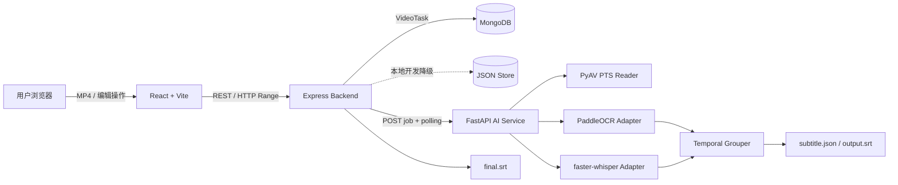
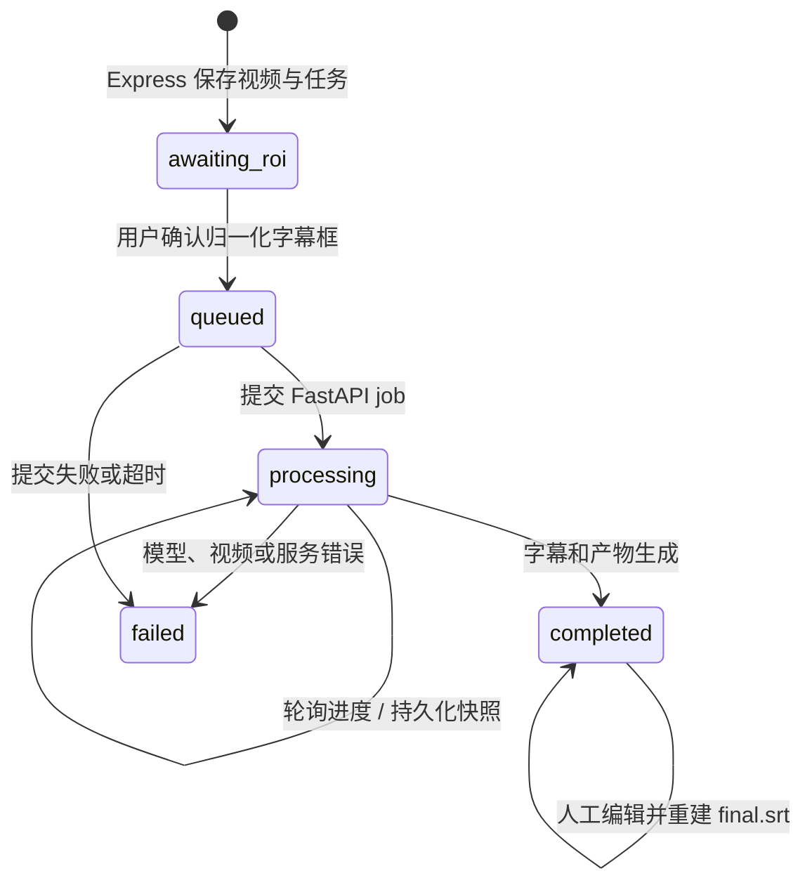

# AI Subtitle Studio 架构说明

## 1. 设计目标

当前版本保证“上传—框选字幕区域—处理—人工校对—保存—导出”闭环稳定。OCR 是画面
硬字幕和时间边界的唯一事实来源；Whisper 只允许对长度相近、语义兼容的当前视觉事件
校字，不会独立补充字幕、改变时间轴或复制后续语音。

## 2. 组件关系



## 3. 任务状态流



Express 是产品任务的事实来源；FastAPI 的 JSON job 快照用于 AI 服务重启诊断。后端
重启后会恢复 `queued` / `processing` 任务；`awaiting_roi` 不会被后台误启动。框选到入队
使用原子状态转换，重复或并发确认返回 409，不会重复创建 AI job。

前端路由固定为 `/tasks`、`/tasks/new`、`/tasks/:id`。URL 是当前任务的事实来源，
不再用 `replaceState` 清除 query；因此刷新、Logo 返回、前进和后退不会销毁任务历史。
归档只设置 `archivedAt` 并从默认列表隐藏任务，不删除视频或字幕产物。

## 4. AI 流水线

1. `VideoReader.probe` 用 PyAV 解码呈现顺序，读取原始 PTS、time base、非零起点、精确
   帧数与时长，并检测 VFR；API 秒值统一由 `(pts - start_pts) * time_base` 派生。
2. `sampled_frames` 按 PTS 采样，仅在采样点转换图像并裁剪用户的任意 x/y/w/h ROI；
   当前真实样例的推荐初始框为 `{x:0.08,y:0.52,width:0.84,height:0.24}`。
3. `PaddleOCREngine` 懒加载模型，兼容 PaddleOCR 2.x 与 3.x 输出结构。
4. 手动 ROI 内保留全部合格候选及其原画面坐标；同帧的重叠备选、同基线碎片和上下行
   字幕先组成可跟踪的完整视觉短语；纯数字仍被过滤，`AND` 等短字幕保留。
5. 多轨时序关联处理同帧多候选、逐词动画、短暂漏帧、嵌套重复和位置一致性；额外的
   廉价视觉变化扫描会在 2 FPS 粗采样间隙中发现 `WATCH OUT` 这类短事件。
6. faster-whisper 生成逐词时间戳，按标点、停顿和最大阅读时长重新断句。
7. 每个粗边界先扫描 64×32 灰度视觉差分，仅在最可能的变化点调用少量 OCR；默认每个
   起点/终点最多新增 2 次 OCR，无法确认时安全保留粗边界。
8. 融合器逐个复制 OCR 事件及其时间/位置，只从 Whisper 的相近长度窗口选择兼容校字。
9. 原始视觉事件、最终结果和诊断分别写入 `ocr_events.json`、`subtitle.json`、
   `output.srt` 与 `diagnostics.json`。

所有 cue 采用 `start` 包含、`end` 不包含，持久化 `start_frame`、
`end_frame_exclusive`、`start_pts`、`end_pts`、`time_base`。`start_time/end_time` 只作为
API、SRT 和 UI 的派生值；人工修改秒边界时前端会清除已失效的原始 PTS 字段。

浏览器预览不用低频 `timeupdate`。`requestVideoFrameCallback` 的 `mediaTime` 驱动二分
查找和时间轴 DOM；不支持时回退到 `requestAnimationFrame + currentTime`。只有命中的
cue id 变化才触发 React state，播放、暂停、seek、拖动和字幕跳转另做立即同步。

## 5. 数据模型

任务主要字段：

```json
{
  "taskId": "uuid",
  "filename": "video.mp4",
  "status": "awaiting_roi",
  "progress": 45,
  "roi": { "x": 0.08, "y": 0.52, "width": 0.84, "height": 0.24 },
  "metadata": { "fps": 30, "width": 1920, "height": 1080, "duration": 60 },
  "subtitles": [],
  "revision": 0,
  "archivedAt": null,
  "error": null
}
```

字幕主要字段：

```json
{
  "id": "uuid",
  "text": "Subtitle text",
  "start_time": 0.0,
  "end_time": 2.0,
  "start_frame": 0,
  "end_frame_exclusive": 60,
  "start_pts": 400,
  "end_pts": 24400,
  "time_base": "1/12000",
  "confidence": 0.95,
  "position": [100, 600, 900, 680],
  "source": "ocr+whisper"
}
```

所有保存操作都校验非负时间、`end_time > start_time`、置信度、坐标与独占帧边界，
按开始时间排序后原子重建 JSON/SRT。旧任务没有 revision 时按 0 读取，不需要批量迁移。

## 6. API 边界

Express 面向浏览器：

- `POST /api/tasks`
- `POST /api/tasks/:id/start`
- `GET /api/tasks?page=&limit=&status=&search=`（轻量摘要）、`GET /api/tasks/:id`
- `GET|PUT /api/tasks/:id/subtitles`
- `PATCH /api/tasks/:id/archive`
- `GET /api/tasks/:id/video`
- `GET /api/tasks/:id/export`

FastAPI 面向 Express：

- `POST /jobs`
- `GET /jobs/:task_id`
- `GET /jobs/:task_id/subtitles`
- `GET /jobs/:task_id/artifacts/:name`
- `GET /health`

## 7. 安全与可靠性

- 后端同时检查扩展名、MIME 与 MP4 `ftyp`，并限制上传大小与 multipart 数量。
- 服务端 UUID 决定磁盘文件名，原文件名不参与路径；视频读取前再次验证路径边界。
- 视频端点支持单 Range，越界返回 416。
- CORS 使用 allowlist，Express 启用 Helmet 和统一错误结构。
- Mongo 连接失败可配置为启动失败；本地默认明确告警后降级 JSON。
- 字幕保存必须携带 `If-Match`/expected revision；文件仓库和 Mongo 仓库都执行原子比较
  更新，旧标签页返回 409。前端 750ms 自动保存，网络失败按 taskId 写 IndexedDB。
- SPA 路由离开脏编辑器时提供“保存并离开 / 放弃修改 / 取消”；真正关闭标签页仍使用
  浏览器原生 `beforeunload` 保护。
- AI 模型懒加载，错误进入 job 的 `failed/error`，不使 API 进程退出。
- job 和文件写入使用单任务 worker 与原子替换，第一版避免同一 CPU 同时加载多份模型。

## 8. 已知边界

- Web 当前要求人工框选 ROI；自动区域建议属于可选 V2 能力。
- YOLO 不是严格时间轴的必要组件。当前方案由手动 ROI 限定字幕带、PaddleOCR text
  detector 定位文字，再由逐帧视觉变化和受预算约束的 OCR 精修边界。YOLO 只能作为
  自动估计 ROI 的可选前置步骤，而且需要针对目标字幕样式训练并评测定制数据/权重。
- 当前单 AI worker 适合本地 MVP，不是多租户生产队列。
- IndexedDB 草稿只存在当前浏览器 profile；它不是跨设备版本历史。冲突草稿会保留，
  但当前 UI 不提供逐行三方合并。
- PaddleOCR 第一次运行需要模型下载；CPU 推理速度与分辨率、FPS 直接相关。
- 已建立完整 2,380 帧视频的 58 状态人工视觉真值：五个 Tier A 事件为相邻帧精确复核，
  其余 Tier B 边界声明 ±18 帧不确定度。整片评测不能被描述成全部单帧精确；语音参考
  也不得代替硬字幕 precision/recall、文本准确率和边界误差真值。
